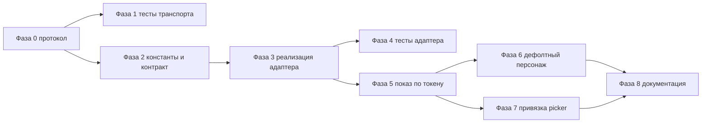

# План: показ листа персонажа по клику на токен (OBR)

## Цель

Дать возможность открывать конкретный лист персонажа longstoryshort.app в ответ на
взаимодействие с токеном на столе Owlbear Rodeo, вместо текущего единственного
фрейма со списком персонажей.

Текущее состояние: бридж монтирует один iframe на
`https://longstoryshort.app/iframe/characters/list/` ([`bridges/dnd/src/main.ts`](../../bridges/dnd/src/main.ts:11)),
транспорт двусторонний через postMessage-конверт
([`src/postMessageProtocol.ts`](../../src/postMessageProtocol.ts:1)), переживает навигацию
iframe (contentWindow читается вживую — [`createBridgeSheetSource`](../../src/createBridgeSheetSource.ts:39)).
Адаптер [`OwlbearAdapter`](../../src/adapters/owlbear/OwlbearAdapter.ts:32) со сценой и
токенами пока не работает.

## Проверка возможностей OBR SDK (по типам в node_modules)

| Возможность | API | Вердикт |
|---|---|---|
| Встроить наш iframe прямо в пункт контекстного меню | [`ContextMenuItem.embed`](../../node_modules/@owlbear-rodeo/sdk/lib/types/ContextMenu.d.ts:31) | ✅ есть — picker рисуется в меню |
| Фильтр пунктов меню по роли GM/метаданным/кол-ву | [`ContextMenuIconFilter`](../../node_modules/@owlbear-rodeo/sdk/lib/types/ContextMenu.d.ts:9) | ✅ есть |
| Поймать выбор токена | [`player.getSelection`](../../node_modules/@owlbear-rodeo/sdk/lib/api/PlayerApi.d.ts:9), [`player.onChange`](../../node_modules/@owlbear-rodeo/sdk/lib/api/PlayerApi.d.ts:24) | ✅ есть |
| Связь токен↔персонаж | [`item.metadata`](../../node_modules/@owlbear-rodeo/sdk/lib/types/items/Item.d.ts:18) + [`updateItems`](../../node_modules/@owlbear-rodeo/sdk/lib/api/scene/SceneItemsApi.d.ts:11) | ✅ общо и персистентно |
| Дефолтный персонаж игрока | [`player.getMetadata/setMetadata`](../../node_modules/@owlbear-rodeo/sdk/lib/api/PlayerApi.d.ts:20) | ✅ приватно, per-player |
| Контейнер-popover при необходимости | [`popover.open`](../../node_modules/@owlbear-rodeo/sdk/lib/api/PopoverApi.d.ts:6) | ✅ есть |

Ограничения, влияющие на дизайн:
- Перетаскиваемых нативных окон нет — только программно позиционируемый popover.
  Drag-n-drop эмулируется переоткрытием popover в новых координатах (паттерн
  [`BRIDGE_CHANNEL`](../../bridges/vortex/src/shared.ts:34) уже есть). В этом плане DnD-окно
  **не используется** — выбран единый основной iframe с навигацией.
- Контекстное меню не имеет раскрывающихся подменю-стрелочек, но `embed` закрывает
  задачу «список персонажей прямо в меню».

## Принятые решения

1. **Показ листа — Вариант B (postMessage-навигация без reload).** Новый исходящий
   ивент host → sheet `dnd:show-character`; лист делает client-side навигацию.
2. **Навигация оформлена отдельными явными ивентами**, а не через capability-модель:
   `dnd:show-character` (host → sheet) и `dnd:active-character` (sheet → host).
3. **Привязка токен↔персонаж** — пункт контекстного меню «Привязать» с `embed`-iframe
   picker от Vortex; результат пишется в `item.metadata`. Доступно только GM.
4. **Дефолтный персонаж игрока** хранится в `player.metadata` (приватно, per-player).
   Пишется при выборе персонажа во фрейме; используется при открытии без выделенного
   токена.

## Архитектура

```mermaid
graph TD
    subgraph Привязка - только GM
        A[ПКМ по токену] --> B[Пункт меню Привязать с embed iframe]
        B --> C[OBR рендерит picker Vortex в меню]
        C --> D[игрок кликает персонажа]
        D --> E[picker шлет vortex-characterSelected charId name]
        E --> F[бридж пишет charId в item.metadata токена]
    end

    subgraph Показ листа
        G[Открытие основного фрейма] --> H{токен выделен?}
        H -->|да, привязан| I[читаем charId из item.metadata]
        H -->|нет| J[читаем дефолт из player.metadata]
        I --> K[dnd-show-character charId в лист]
        J --> K
        K --> L[лист навигирует без reload]
        L --> M[лист шлет dnd-active-character charId]
        M --> N[бридж пишет charId в player.metadata как дефолт]
    end
```



## Изменения в протоколе (`src/types.ts`)

```ts
/** Откуда инициирована навигация — для разметки аналитики на стороне листа. */
export type ShowCharacterSource = 'token-click' | 'context-menu' | 'default';

/** host → sheet: навигировать встроенный лист на персонажа. Без id → показать список. */
export interface ShowCharacterPayload {
    characterId?: string;
    /** Метка происхождения навигации; лист использует её для разметки событий. */
    source?: ShowCharacterSource;
}

/** sheet → host: подтверждение навигации / выбора персонажа во фрейме. */
export interface ActiveCharacterPayload {
    characterId: string;
    characterName: string;
    status: 'shown' | 'not-found' | 'forbidden';
}
```

Расширить `SheetEvent`:
- `{ type: 'dnd:show-character'; payload: ShowCharacterPayload }` — host → sheet.
- `{ type: 'dnd:active-character'; payload: ActiveCharacterPayload }` — sheet → host.

## Изменения в адаптере OBR

Константы ([`src/adapters/owlbear/constants.ts`](../../src/adapters/owlbear/constants.ts:1)):
- `CHARACTER_ID_KEY = 'rodeo.lss/character-id'` — ключ метаданных токена.
- `DEFAULT_CHARACTER_KEY = 'rodeo.lss/default-character'` — ключ метаданных игрока.
- id контекстных меню `OPEN_SHEET_MENU_ID`, `BIND_CHARACTER_MENU_ID`.

[`ObrAdapter`](../../src/adapters/owlbear/types.ts:10) и
[`OwlbearAdapter`](../../src/adapters/owlbear/OwlbearAdapter.ts:32) — новые методы:
- `getSelection(): Promise<string[]>` / `onSelectionChange(handler): () => void`.
- `getItemMetadata(itemId, key)` / `setItemMetadata(itemId, key, value)`.
- `getPlayerMetadata(key)` / `setPlayerMetadata(key, value)`.
- `createContextMenu(config)` / `removeContextMenu(id)` — с поддержкой `embed` и `filter`.

## Изменения в бридже (`bridges/dnd/src/main.ts`)

1. Регистрация пункта меню «Открыть лист» (всем, фильтр — токен с `character-id`).
2. Регистрация пункта «Привязать» с `embed`-iframe picker (фильтр — роль GM, один токен).
3. Подписка `onSelectionChange`: при выборе одного привязанного токена читать
   `item.metadata` и слать `dnd:show-character` в лист.
4. Приём `vortex:characterSelected` из embed-picker → запись `charId` в `item.metadata`.
5. Приём `dnd:active-character` → запись в `player.metadata` как дефолт.
6. При старте без выделенного токена — открыть дефолт из `player.metadata`.

## Внешние зависимости (вне этого репозитория)

- **Приложение-лист longstoryshort.app**: принять `dnd:show-character` и навигировать
  без reload; эмитить `dnd:active-character`; показывать «нет доступа» при `forbidden`
  (права остаются на сервере листа).
- **Vortex vortex.longstoryshort.app**: отдать страницу-picker
  `…/room/{roomId}/picker`, эмитящую `vortex:characterSelected { characterId, name }`
  (по аналогии с существующим [`vortex:roomSelected`](../../bridges/vortex/src/shared.ts:66)).

## Безопасность

- Права не проверяются в бридже — лист сам решает по auth, показать персонажа или
  заглушку «нет доступа». Игрок, кликнувший чужой токен, получит `forbidden`.
- Навигация per-player (выделение в OBR индивидуально) — синхронизация между
  клиентами не требуется.
- postMessage-конверт и origin-фильтрация остаются прежними; токен/cookie листа за
  границу фрейма не уходят.

## Аналитика и разметка событий

Релиз интеграции с OBR изменит **природу** трафика на листе: каждый показ персонажа
по токену — это SPA-переход на фрейме, который при стандартной настройке трекается
как `page_view`. Без разметки это механически раздует page views, глубину просмотров
и занизит bounce rate, сделав тренды «до/после релиза» несопоставимыми. Это не
поломка, но искажение, если встроенные переходы сольются с органическими.

### Принцип

Встроенную навигацию нужно отделять от органических заходов на сайт. Точка разметки
естественна — навигацию всегда инициирует бридж через `dnd:show-character`, поэтому
он может передать метку контекста, а лист — разметить по ней аналитику.

### Что закладываем

1. **Метка происхождения в протоколе.** Поле `source: ShowCharacterSource`
   (`'token-click' | 'context-menu' | 'default'`) в `ShowCharacterPayload` (см. раздел
   протокола выше). Бридж проставляет его при каждой навигации.
2. **Измерение embedded_context.** Лист, открытый во фрейме OBR, должен знать, что он
   встроен — например через query-параметр `?embed=obr` при первичной загрузке iframe
   или из `source`. В аналитике это отдельное измерение `embedded_context = obr`,
   позволяющее одним фильтром отделить встроенные просмотры от органики.
3. **Отдельный тип события.** SPA-переход внутри стола трекать не как обычный
   `page_view`, а как кастомное `sheet_opened` с параметрами
   (`trigger: token-click | context-menu | default`, `embedded: true`). Это даёт
   продуктовую метрику без загрязнения web-аналитики.

### Польза

При корректной разметке релиз не портит аналитику, а добавляет новый слой инсайтов:
сколько листов открывают за игровую сессию, переключаются ли между персонажами,
используют ли привязку токенов. Эти данные сейчас недоступны.

### Граница ответственности

- Этот SDK-репозиторий: только **прокидывает метку** `source` в `dnd:show-character`
  (Фаза 0 — поле протокола, Фаза 5/6 — бридж проставляет значение).
- Реализация трекинга (`embedded_context`, событие `sheet_opened`, фильтры воронок) —
  на стороне приложения-листа longstoryshort.app. Зафиксировано во внешних требованиях.

## Этапы реализации

Порядок выстроен снизу вверх: сначала протокол ядра (без зависимостей), затем
адаптер OBR, затем сборка в бридже, и в конце документация и внешние контракты.
Каждая фаза самодостаточна — её можно смержить и протестировать отдельно.

### Фаза 0 — подготовка протокола ядра (без OBR)

Файлы: [`src/types.ts`](../../src/types.ts:1), [`src/index.ts`](../../src/index.ts:1).

1. Добавить интерфейсы `ShowCharacterPayload` и `ActiveCharacterPayload`.
2. Расширить union `SheetEvent` двумя ветками `dnd:show-character` (host → sheet) и
   `dnd:active-character` (sheet → host).
3. Экспорт новых типов через `export * from './types'` уже покрывает их — проверить,
   что они видны из публичного входа.

Критерий готовности: `tsc` зелёный, новые типы импортируются из пакета. Транспорт
([`createBridgeSheetSource`](../../src/createBridgeSheetSource.ts:39),
[`createSheetClient`](../../src/createSheetClient.ts:18)) не требует правок — он
прозрачен к типам события.

### Фаза 1 — тесты транспорта на новые ивенты

Файлы: [`src/createBridgeSheetSource.test.ts`](../../src/createBridgeSheetSource.test.ts:1),
[`src/createSheetClient.test.ts`](../../src/createSheetClient.test.ts:1).

1. Тест: `send({ type: 'dnd:show-character', payload })` из бриджа доходит до листа.
2. Тест: `dnd:active-character` из листа доходит до `onEvent` бриджа.
3. Тест: чужой origin / чужой contentWindow по-прежнему игнорируются для новых типов.

Критерий готовности: новые тесты зелёные, существующие не сломаны.

### Фаза 2 — константы и расширение контракта адаптера

Файлы: [`src/adapters/owlbear/constants.ts`](../../src/adapters/owlbear/constants.ts:1),
[`src/adapters/owlbear/types.ts`](../../src/adapters/owlbear/types.ts:1).

1. Константы: `CHARACTER_ID_KEY = 'rodeo.lss/character-id'`,
   `DEFAULT_CHARACTER_KEY = 'rodeo.lss/default-character'`,
   `OPEN_SHEET_MENU_ID`, `BIND_CHARACTER_MENU_ID`.
2. Расширить интерфейс `ObrAdapter` сигнатурами новых методов (selection, item
   metadata, player metadata, context menu) — типы аргументов через типы OBR SDK.
3. Реэкспорт новых констант из [`src/adapters/owlbear/index.ts`](../../src/adapters/owlbear/index.ts:1).

Критерий готовности: контракт компилируется; класс ещё не реализует методы —
ожидаемые ошибки `tsc` на уровне класса закрываются в Фазе 3.

### Фаза 3 — реализация методов в OwlbearAdapter

Файл: [`src/adapters/owlbear/OwlbearAdapter.ts`](../../src/adapters/owlbear/OwlbearAdapter.ts:32).

1. `getSelection()` / `onSelectionChange(handler)` — поверх
   [`player.getSelection`](../../node_modules/@owlbear-rodeo/sdk/lib/api/PlayerApi.d.ts:9)
   и [`player.onChange`](../../node_modules/@owlbear-rodeo/sdk/lib/api/PlayerApi.d.ts:24);
   из `onChange` извлекать `player.selection` и отдавать наружу массив id.
2. `getItemMetadata(itemId, key)` — через
   [`scene.items.getItems`](../../node_modules/@owlbear-rodeo/sdk/lib/api/scene/SceneItemsApi.d.ts:9)
   по фильтру id; `setItemMetadata(itemId, key, value)` — через
   [`updateItems`](../../node_modules/@owlbear-rodeo/sdk/lib/api/scene/SceneItemsApi.d.ts:11)
   с мутацией `draft.metadata[key]`.
3. `getPlayerMetadata(key)` / `setPlayerMetadata(key, value)` — через
   [`player.getMetadata/setMetadata`](../../node_modules/@owlbear-rodeo/sdk/lib/api/PlayerApi.d.ts:20).
4. `createContextMenu(config)` / `removeContextMenu(id)` — через `contextMenu.create`
   с поддержкой `embed` и `filter` (роль GM, кол-во, наличие ключа метаданных).
5. Все методы best-effort: безопасны до `ready()`, ловят ошибки как существующие
   `notify`/`broadcast`.

Критерий готовности: `tsc` зелёный, методы покрыты юнит-тестами на mock-OBR.

### Фаза 4 — юнит-тесты адаптера

Новый файл: `src/adapters/owlbear/OwlbearAdapter.test.ts` (mock OBR, образец —
[`bridges/vortex/test-mock-obr.html`](../../bridges/vortex/test-mock-obr.html)).

1. `setItemMetadata` вызывает `updateItems` с правильной мутацией ключа.
2. `getPlayerMetadata`/`setPlayerMetadata` пробрасывают значения корректно.
3. `onSelectionChange` дёргает handler с массивом id при изменении выбора.
4. `createContextMenu` передаёт `embed` и `filter` без искажений.

### Фаза 5 — показ листа по выбору токена (бридж, ядро фичи)

Файл: [`bridges/dnd/src/main.ts`](../../bridges/dnd/src/main.ts:1).

1. После `adapter.ready()` зарегистрировать пункт меню «Открыть лист» (фильтр —
   токен с непустым `CHARACTER_ID_KEY`).
2. Подписаться на `onSelectionChange`: при выборе ровно одного привязанного токена
   прочитать `getItemMetadata` и вызвать
   `source.send({ type: 'dnd:show-character', payload: { characterId } })`.
3. Обработать пункт меню «Открыть лист» (onClick) аналогично — для явного открытия.

Критерий готовности: выбор привязанного токена шлёт `dnd:show-character` в iframe
(проверяется в DEV-логах / mock-листе).

### Фаза 6 — дефолтный персонаж игрока (бридж)

Файл: [`bridges/dnd/src/main.ts`](../../bridges/dnd/src/main.ts:1).

1. Подписаться на `source.onEvent` для `dnd:active-character`: при `status === 'shown'`
   вызвать `setPlayerMetadata(DEFAULT_CHARACTER_KEY, characterId)`.
2. При инициализации, если выделенного токена нет, прочитать
   `getPlayerMetadata(DEFAULT_CHARACTER_KEY)` и отправить `dnd:show-character`
   с этим id (или без id → список, если дефолта нет).

Критерий готовности: повторное открытие восстанавливает последнего персонажа игрока.

### Фаза 7 — привязка через embed-picker (бридж + контракт Vortex)

Файлы: [`bridges/dnd/src/main.ts`](../../bridges/dnd/src/main.ts:1),
[`bridges/vortex/src/shared.ts`](../../bridges/vortex/src/shared.ts:1).

1. Зарегистрировать пункт меню «Привязать» с `embed.url` на picker-страницу Vortex
   (фильтр — роль GM, ровно один токен).
2. Добавить тип сообщения `vortex:characterSelected { characterId, name }` в
   `VortexHostMessage` и в `isVortexMessage` (либо описать как внешний контракт, если
   picker отдаётся другим репозиторием).
3. В бридже слушать это сообщение, узнать id целевого токена (из контекста меню /
   текущего выбора) и записать `setItemMetadata(itemId, CHARACTER_ID_KEY, characterId)`.

Критерий готовности: GM привязывает персонажа из списка комнаты, метаданные токена
обновляются, пункт «Открыть лист» становится активным.

### Фаза 8 — документация и внешние требования

Файлы: [`README.md`](../../README.md:1), [`docs/sdk-guide.md`](../../docs/sdk-guide.md:1),
[`docs/bridge-guide.md`](../../docs/bridge-guide.md:1).

1. Добавить `dnd:show-character` и `dnd:active-character` в таблицы протокола.
2. Описать новые методы `OwlbearAdapter` в reference-таблице bridge-guide.
3. Описать сценарий «показ листа по токену» с диаграммой.
4. Зафиксировать внешние требования (раздел ниже) как контракт для команд листа и
   Vortex.

### Внешние работы (другие репозитории, вне этого плана кода)

- **longstoryshort.app (лист)**: приём `dnd:show-character` с client-side навигацией
  без reload; эмит `dnd:active-character` с корректным `status`; экран «нет доступа»
  при `forbidden`.
- **vortex.longstoryshort.app**: страница-picker `…/room/{roomId}/picker`, эмитящая
  `vortex:characterSelected`.

### Зависимости между фазами


